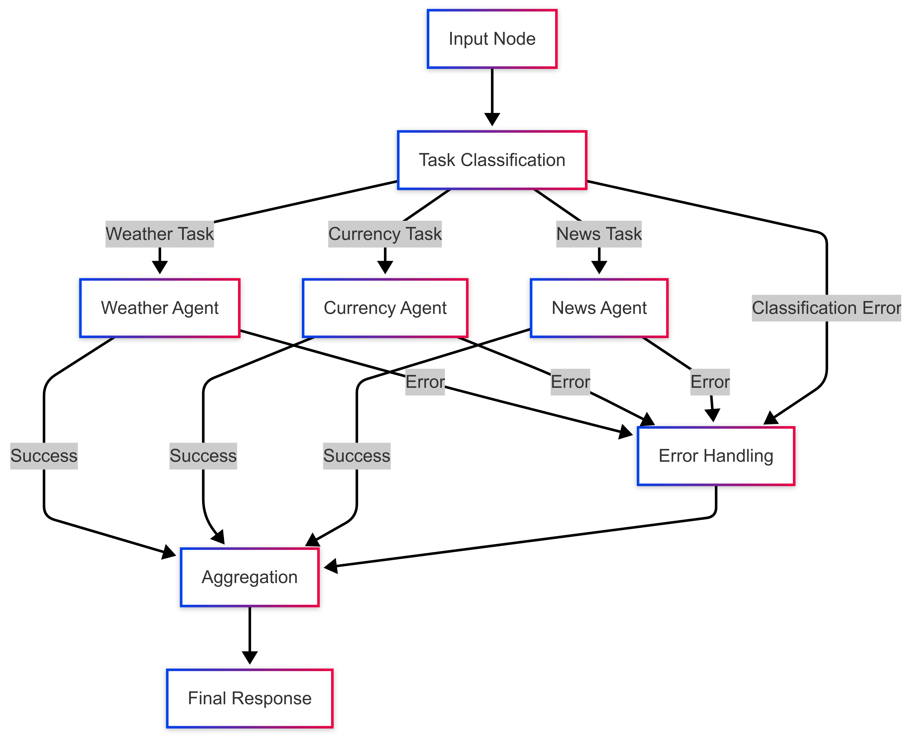

# Multi-Agent System for Information Queries

This project aims to build a system based on autonomous agents to process and handle queries from multiple domains (news, weather, currency, etc.). It uses **LangGraph** to structure and execute the agents' workflows. The project is in its early development stage, where some key notebooks have been completed, and several improvements have been identified for implementation in future phases.

## Project Description
The system is designed to classify user queries and assign them to specialized agents (news, weather, currency) that work together to provide integrated information. It uses a Directed Acyclic Graph (DAG) approach to manage the workflow between different components.

## Required Environment Variables
Before running the system, make sure to define the following environment variables:

- `DISABLE_LOGGING`: If present, disables custom logs.
- `OPENWEATHER_API_KEY`: Key for consuming the weather API.
- `EXCHANGE_API_KEY`: Key for querying exchange rates.
- `NEWS_API_KEY`: Key for international news.
- `OPENAI_API_KEY`: Key for the LLM used by the agents.


### Logging Configuration

To enable or disable logging, set the following environment variable:

- To **disable logging**, set the variable to `true`:

```bash
DISABLE_LOGGING=true
```

- To **enable logging**, set the variable to `false`:

```bash
DISABLE_LOGGING=false
```

This configuration allows you to control whether logs are generated during the execution of the application.


## Project Structure

Below is the project structure, organized into different directories to modularize the key components of the system:

```plaintext
my_agent_project/
│
├── agents/
│   ├── news_agent.py           # News agent
│   ├── weather_agent.py        # Weather agent
│   └── currency_agent.py       # Currency agent
│
├── images/                     # Directory for images (documentation, visual resources, etc.)
│
├── nodes/
│   ├── classify_query.py       # Node for classifying queries
│   ├── order_tasks.py          # Node for ordering tasks
│   └── error_handler.py        # Node for error handling
│
├── prompts/
│   └── templates.py            # Common prompt templates for interacting with models
│
├── base/
│   ├── agent_state.py          # Agent state (AgentState)
│   └── engine.py               # Engine that runs the agent pipeline or DAG
│   └── llm.py                  # LLMs models 
│
├── config/
│   ├── api_keys.py             # API key management (should be used with .env file)
│   └── settings.py             # General project settings
│
├── utils/
│   ├── api_helpers.py          # Helper functions for handling API calls
│   ├── logging_utils.py        # Logging utilities
│   └── error_utils.py          # Common functions for error handling
│
├── api/
│   ├── routes.py               # API route definitions
│   ├── middleware.py           # Middleware for the API
│   └── server.py               # Server setup for the API
│
├── notebooks/
│   ├── 01_business_requirements.ipynb   # Business requirements
│   ├── 02_agent_design.ipynb            # Agent design
│   ├── 03_prompt_engineering.ipynb      # Prompt development
│   ├── 04_agent_prototyping.ipynb       # Initial prototype
│   ├── 05_agent_evaluation.ipynb        # Performance evaluation
│   ├── 06_agent_optimization.ipynb      # Agent optimization
│   ├── 07_agent_integration.ipynb       # Component integration (agent testing)
│   ├── 08_deployment_strategy.ipynb     # Deployment strategy
│   ├── 09_monitoring_setup.ipynb        # Monitoring setup
│   └── 10_future_improvements.ipynb     # Future improvements
│
├── tests/
│   ├── test_agents.py                # Unit tests for agents
│   ├── test_nodes.py                 # Unit tests for nodes
│   └── test_integration.py           # Integration tests between components
│
├── docs/
│   ├── architecture.md               # Documentation on architecture
│   ├── api_reference.md              # API reference
│   └── user_guide.md                 # User guide for interacting with the system
│
├── examples/
│   ├── basic_query.py                # Simple query example
│   └── compound_query.py             # Compound query example
│
├── logs/
│   └── .gitkeep                      # Folder for log files
│
├── .env.example                      # Environment variable template
├── requirements.txt                  # Project dependencies
├── setup.py                          # To install the project as a package
├── README.md                         # Main documentation
└── main.py                           # Main orchestrator to run the system
```

## How the Graph Model Works
The system uses LangGraph to implement a workflow based on a graph:



1. **Classification**: The `classify_query` node analyzes the user query and determines which agents are needed.
2. **Ordering**: The `order_tasks` node sets the sequence in which results will be presented to the user by the integrator node.
3. **Agent Execution**: Specialized agents are executed based on the established plan.
4. **Completion Check**: The system verifies that all required components have been executed.
5. **Response Integration**: Responses from each agent are integrated into a coherent result.
6. **Error Handling**: Basic error handling is implemented across the workflow.

## Completed Notebooks

The following notebooks have been completed. They contain the basic structure and agent integration:

1. **01_business_requirements.ipynb**: Defines business requirements.
2. **02_agent_design.ipynb**: Designs agents to handle queries.
3. **04_agent_prototyping.ipynb**: Initial prototype to test each component individually (nodes and subagents).
4. **06_agent_evaluation.ipynb**: Technical, ethical, cognitive, and security testing plan.
5. **07_agent_integration.ipynb**: Integration of system components and agent testing.
6. **08_deployment_strategy.ipynb**: Proposed infrastructure architecture and checklist for production deployment.
7. **10_future_improvements.ipynb**: Improvements and pending tasks before productionizing.
   
## How to Run the PoC

### Prerequisites
```bash
# Install dependencies
pip install -r requirements.txt
```

### Execution
The system can be executed in two ways:

1. **Via script**:
    ```bash
    # Not implemented yet
    python main.py "What is the weather and exchange rate in Mexico City today?"
    ```

2. **Via notebook**:

   Open the `notebooks/07_agent_integration.ipynb` notebook and run all cells.